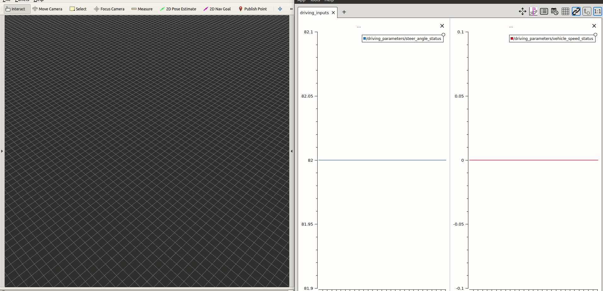

# Vehicle Odometry
Implementation of bicycle model for a 2D vehicle odometry with ROS. 

# Requirements
* ROS (Robot Operating System)
# How to use
1. Clone this repo.

    ```bash
    git clone https://github.com/CelilSincanli/vehicle_odometry.git
    ```
2.  Go to project directory

    ```bash
    cd vehicle_odometry
    ```
3.  Compile the package and source the workspace

    ```bash
    catkin build
    source devel/setup.bash
    ```
4.  Run the launch and the bag file 

    ```bash
    roslaunch bicycle_model_odometry default.launch
    rosbag play --clock ~/vehicle_odometry/src/bicycle_model_odometry/bag_files/driving_status_1.bag
    ```

# Example

